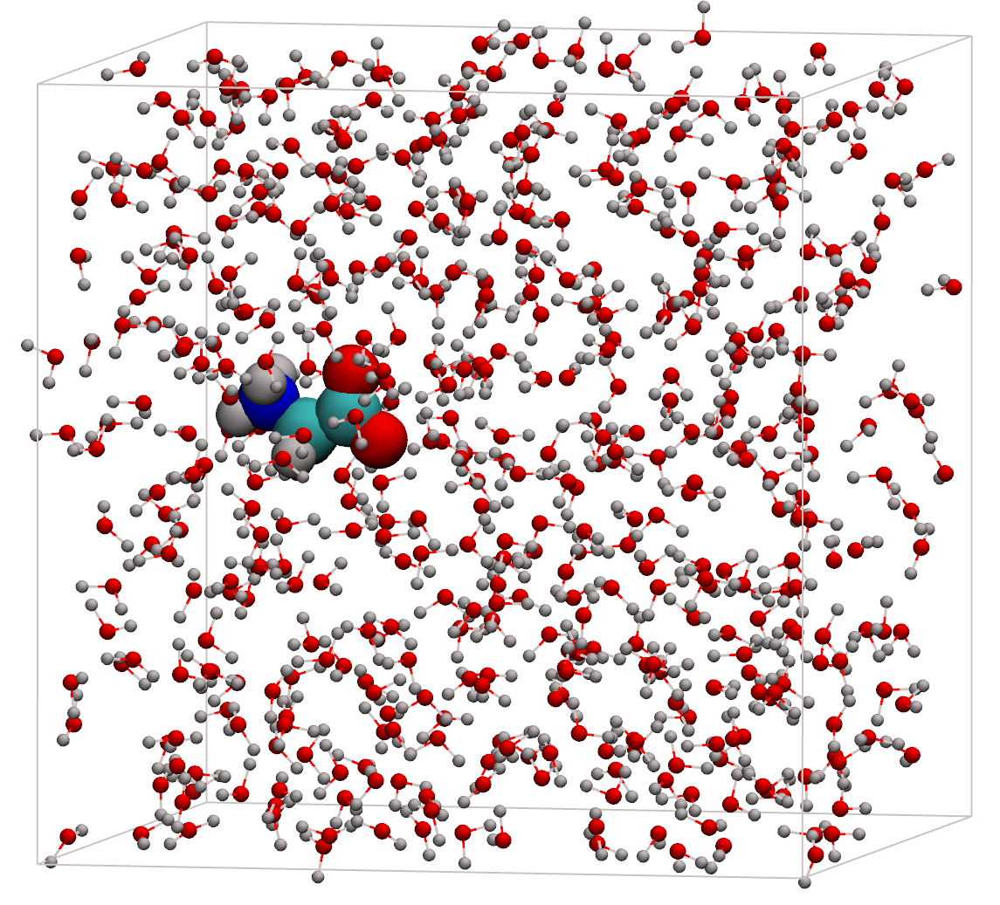

Репозиторий посвящён выполнению тестового задания на стажировку в отдел структурной биоинформатики BIOCAD. Здесь находятся файлы, использованные при вычислении свободной энергии растворения в воде молекулы глицина. Для воспроизведения необходимо наличие установленного пакета GROMACS. 

Для воспроизведения протокола вычисления свободной энергии молекулы глицина необходимо запустить bash скрипт run_freee_energy.sh

Свободная энергия растворения вычисляется методом термодинамического интегрирования и Bennett acceptance ratio. В данном реализации система проходит из состояния А, в котором все взаимодействия глицин-вода включены, в состояние B, где электростатика и Леннард-Джонс взаимодейсвтие глицин-вода отключены.

Также рассматриваются радиальные функции распределения молекул воды относительно различных атомов молекулы глицина.

